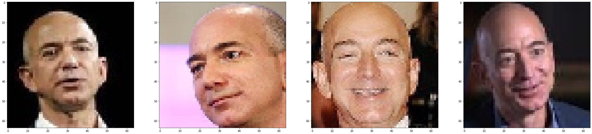
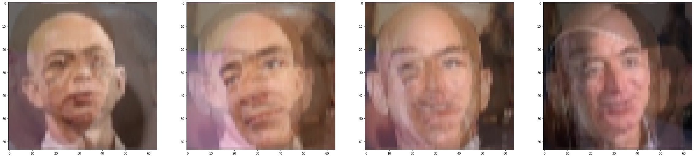
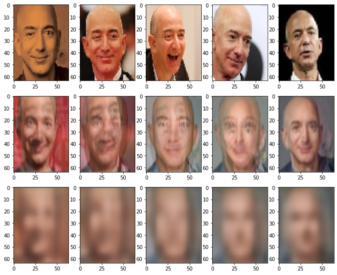

# BlurRemovalUsingAutoencoders
BlurRemoval-Using-an-Autoencoder Are you poor at taking photos Just like me? Here I have made a Deep learning  model using Autoencoder architecture to remove unwanted blur from the image. Autoencoders consists of two neural networks, Encoder network and a Decoder network. Technically speaking there are four types of blurs they are, Defocussed, Rectangular, Motional blur and Gaussian blur. Here, In my model I deliberately caused blury effect on the dataset by moving the kernels around the original image. Image corruption is a challenge we face while clicking photographs. My model decreases the amount of noise in the image by reconstructing the image. My model performed well on test data despite of limited computational power. One can see the reconstructed image and it is apparent that the model has tried to reconstruct the original image using the blury image. I trained my model for 1000 epochs at first then reduced to 100 epochs. I used EarlyStoppinh regularization technique to avoid the overfitting. The output is shown below. The forst row represents the original images, Second row images represents the Blury images and Third row represents the Reconstructed image(output).

# Original image

# Blury image

# Output reconstruction image

